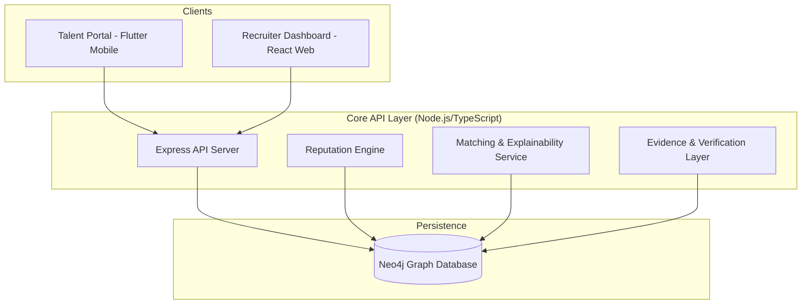

# SkillGraph 🌐
### The Verifiable Micro-Skills Network

**SkillGraph** is a decentralized identity and talent matching platform that replaces the static, unverified CV with a dynamic, living graph of micro-skills. By leveraging graph database technology and explainable AI, SkillGraph connects talent to opportunity through **verifiable fit**, not keyword luck.

---

## 🚀 Vision
In today's job market, resumes are self-reported and static. Recruiters struggle with "keyword stuffing," while talent lacks a way to prove their skills across projects. SkillGraph builds a **living profile** that grows with every project, peer endorsement, and completed challenge, providing a transparent and explainable reputation layer for the future of work.

---

## 🏗️ Architecture
SkillGraph is built on a modern, distributed architecture designed for scale and transparency.



### Component Breakdown
- **Backend (Node.js/Express)**: A robust TypeScript API managing the graph state, reputation calculations, and similarity searches.
- **Graph Database (Neo4j)**: The heart of the system, storing complex relationships between Users, Skills, Endorsements, and Evidence.
- **Mobile Frontend (Flutter)**: The **Talent Portal** where users manage their skills, link evidence (GitHub, Portfolios), and request peer endorsements.
- **Web Frontend (React/Vite)**: The **Recruiter Command Center** for advanced search, graph visualization, and explainable talent matching.

---

## ✨ Key Features

### 1. Verifiable Micro-Skills Graph
Instead of broad categories like "Software Engineer," SkillGraph tracks granular micro-skills (e.g., `Neo4j Optimization`, `Flutter State Management`). Each skill node in the graph is connected to:
- **Evidence**: Links to PRs, commits, or certificates.
- **Endorsements**: Context-weighted peer reviews.
- **Assessments**: Automated verification from external providers.

### 2. Explainable AI Matching (XAI)
Recruiters don't just get a list of names; they get a **Fit Score** with a breakdown of *why* a candidate is a match.
- **Path Analysis**: Shows the connection between the candidate's skills and the job requirements.
- **Strength Metrics**: Visualizes the depth of evidence and endorsement weight.

### 3. Advanced Reputation Engine
Using algorithms like **EigenTrust**, SkillGraph weights endorsements based on the reputation of the endorser within that specific skill domain, preventing "endorsement collusion" and ensuring high-signal profiles.

---

## 🛠️ Tech Stack

| Layer | Technology |
| :--- | :--- |
| **Backend** | Node.js, Express, TypeScript |
| **Database** | Neo4j (Cypher) |
| **Mobile** | Flutter, Dart |
| **Web UI** | React, Vite, Lucide |
| **Validation** | Zod, TypeScript |
| **Infrastructure** | Docker, Docker-Compose |

---

## 🔄 Workflow

1. **Profile Building**: Talent creates a profile via the Flutter app, importing skills and linking evidence.
2. **Verification**: The system ingests evidence and calculates initial weights. Peers provide endorsements, which are processed by the Reputation Engine.
3. **Search & Discovery**: Recruiters use the Web Dashboard to search for specific skill combinations.
4. **Explainable Match**: The system performs a graph-traversal search to find candidates and generates an explainability report for the recruiter.

---

## 🚦 Getting Started

### Prerequisites
- Node.js (v18+)
- Flutter SDK (latest)
- Docker & Docker Compose (for Neo4j)

### Backend & Web UI Setup
1. **Clone the repo**:
   ```bash
   git clone <repo-url>
   cd SkillGraph
   ```
2. **Setup Environment**:
   ```bash
   cp .env.example .env
   # Update NEO4J_URI, NEO4J_USER, NEO4J_PASSWORD
   ```
3. **Launch Database**:
   ```bash
   docker-compose up -d
   ```
4. **Install & Run**:
   ```bash
   npm install
   npm run dev      # Starts Backend & Vite Dev Server
   ```

### Mobile App Setup
1. **Navigate to mobile dir**:
   ```bash
   cd mobile-frontend
   ```
2. **Install dependencies**:
   ```bash
   flutter pub get
   ```
3. **Run the app**:
   ```bash
   flutter run
   ```

---

## 🧠 Engineering Highlights
- **Graph Schema**: Optimized for deep relationship traversal to find "hidden gem" talent.
- **Anomaly Detection**: Background workers monitor the graph for suspicious endorsement clusters.
- **Modular Services**: Decoupled matching logic allows for easy iteration on similarity algorithms.

---

## 👥 The Team - TechFluence
Dedicated to building the future of verifiable talent.

---
*Generated by Antigravity for the SkillGraph Judges.*
